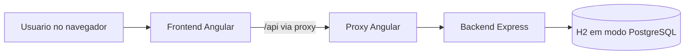
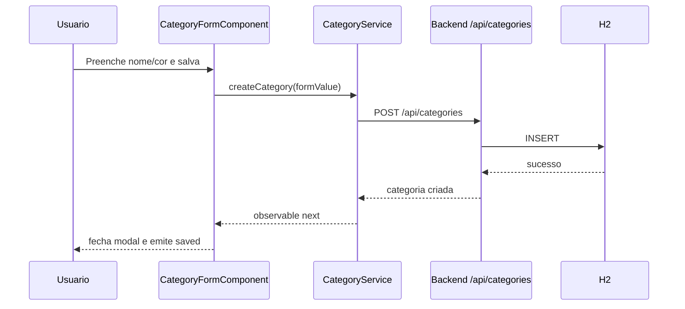

# Documentacao tecnica completa do fintrack

## 1. Objetivo desta documentacao

Este documento explica o projeto inteiro de forma didatica, com foco em:

- entender rapidamente o que a aplicacao faz
- mostrar como frontend e backend se conversam
- explicar a responsabilidade de cada arquivo importante
- registrar as regras de negocio implementadas
- facilitar a apresentacao do projeto em uma entrevista tecnica
- destacar pontos fortes, riscos e melhorias possiveis

Este codigo tem perfil de teste tecnico para vaga, entao a documentacao tambem foi pensada para ajudar quem vai avaliar ou defender o projeto.

---

## 2. O que e o fintrack

O fintrack e uma aplicacao full stack de controle financeiro pessoal.

Ela foi dividida em tres modulos principais:

1. `Dashboard`
2. `Transacoes`
3. `Categorias`

No uso normal, o usuario:

- cadastra categorias
- cadastra entradas e saidas
- pode marcar uma transacao como agendada
- acompanha o saldo e os agregados no dashboard

---

## 3. Visao funcional

### 3.1 Dashboard

O dashboard mostra:

- saldo atual
- total de entradas do mes
- total de saidas do mes
- quantidade de transacoes de entrada e saida
- grafico de saldo por periodo
- distribuicao das transacoes por categoria

Tambem existe:

- botao de atualizar
- filtro por categoria no grafico

### 3.2 Transacoes

O modulo de transacoes permite:

- listar transacoes em tabela
- filtrar por categoria
- filtrar por tipo
- criar transacoes
- editar transacoes
- excluir transacoes
- abrir detalhes de uma transacao
- agendar uma transacao futura

### 3.3 Categorias

O modulo de categorias permite:

- listar categorias
- destacar favoritas
- pesquisar por nome
- criar categoria
- editar categoria
- remover categoria
- marcar ou desmarcar favorito
- escolher cor da categoria

---

## 4. Stack e decisoes tecnicas

## 4.1 Frontend

- Angular 20
- TypeScript
- RxJS
- PrimeNG
- Tailwind CSS
- Chart.js
- Vitest

### Decisoes importantes

- uso de componentes standalone em vez de NgModules
- organizacao por feature
- formularios reativos para validacao
- servicos de dominio para concentrar regras e chamadas HTTP
- fallback local em `localStorage`

## 4.2 Backend

- Node.js
- Express
- pg
- uuid
- Vitest
- Supertest
- H2 Database rodando em modo PostgreSQL

### Decisoes importantes

- backend simples, focado em CRUD
- banco H2 local para facilitar execucao sem infraestrutura externa
- inicializacao automatica do banco na primeira subida
- endpoint agregado para dashboard

---

## 5. Arquitetura geral

## 5.1 Diagrama de alto nivel



## 5.2 Observacao importante sobre o dashboard

Existe um detalhe relevante no projeto:

- o backend possui o endpoint `GET /api/dashboard`
- mas o frontend nao consome esse endpoint para montar a tela principal
- a tela de dashboard do Angular calcula os agregados localmente a partir de transacoes e categorias

Isso significa que hoje existem duas implementacoes de logica de dashboard:

1. uma no frontend
2. outra no backend

Essa duplicacao funciona para o escopo do teste, mas em um projeto maior seria melhor centralizar a regra em um unico lado.

---

## 6. Estrutura do repositorio

```text
fintrack/
|-- backend/
|   |-- data/
|   |-- lib/
|   |-- scripts/
|   |-- src/
|   |   |-- db.js
|   |   |-- schema.js
|   |   |-- server.js
|   |   `-- utils/
|   |       `-- transaction-rules.js
|   `-- test/
|-- docs/
|   |-- plano-testes-prova-tce.md
|   `-- documentacao-tecnica-completa.md
|-- src/
|   |-- app/
|   |   |-- core/
|   |   |   |-- models/
|   |   |   |-- services/
|   |   |   `-- utils/
|   |   |-- features/
|   |   |   |-- categories/
|   |   |   |-- dashboard/
|   |   |   `-- transactions/
|   |   |-- shared/
|   |   |   `-- components/
|   |   |       `-- sidebar/
|   |   |-- app.component.*
|   |   `-- app.routes.ts
|   |-- test/
|   |-- index.html
|   `-- main.ts
|-- README.md
|-- angular.json
|-- package.json
|-- proxy.conf.json
`-- vitest.config.ts
```

---

## 7. Modelos de dados

Os contratos principais estao em [`src/app/core/models/index.ts`](../src/app/core/models/index.ts).

## 7.1 Category

Representa uma categoria financeira.

Campos:

- `id`: identificador unico
- `name`: nome da categoria
- `color`: cor de exibicao
- `icon`: opcional
- `isFavorite`: define se a categoria aparece entre favoritas
- `createdAt`: data de criacao
- `updatedAt`: data de atualizacao

## 7.2 Transaction

Representa uma transacao financeira.

Campos:

- `id`
- `description`
- `value`
- `type`: `entrada` ou `saida`
- `categoryId`
- `category`: objeto da categoria, quando carregado com join
- `date`: data base da transacao
- `scheduledDate`: data efetiva se a transacao for agendada
- `isScheduled`
- `notes`
- `createdAt`
- `updatedAt`

## 7.3 DashboardStats

Representa os dados agregados mostrados no dashboard.

Campos:

- `currentBalance`
- `monthlyIncome`
- `monthlyExpense`
- `incomeCount`
- `expenseCount`
- `byCategory`
- `monthlyEvolution`

## 7.4 ApiResponse<T>

Padroniza o retorno das chamadas HTTP:

- `success`
- `data`
- `message`
- `errors`

---

## 8. Frontend explicado por camadas

## 8.1 Bootstrap da aplicacao

Arquivo: [`src/main.ts`](../src/main.ts)

Responsabilidade:

- iniciar a aplicacao Angular
- registrar o router
- registrar o HttpClient
- habilitar animacoes

Resumo:

- `bootstrapApplication(AppComponent, ...)`
- `provideRouter(routes)`
- `provideHttpClient()`
- `provideAnimations()`

Essa abordagem segue o estilo moderno do Angular com componentes standalone.

## 8.2 Componente raiz

Arquivo: [`src/app/app.component.ts`](../src/app/app.component.ts)  
Template: [`src/app/app.component.html`](../src/app/app.component.html)

Responsabilidade:

- montar o layout principal
- exibir sidebar fixa
- exibir cabecalho
- renderizar a rota ativa com `router-outlet`

Layout geral:

- esquerda: sidebar
- direita: conteudo da pagina
- topo: header com titulo e icones

## 8.3 Rotas

Arquivo: [`src/app/app.routes.ts`](../src/app/app.routes.ts)

Rotas configuradas:

- `/dashboard`
- `/transactions`
- `/categories`

Regras de navegacao:

- rota vazia redireciona para `dashboard`
- rota desconhecida tambem redireciona para `dashboard`

---

## 9. Frontend explicado por modulo

## 9.1 Shared: Sidebar

Arquivos:

- [`src/app/shared/components/sidebar/sidebar.component.ts`](../src/app/shared/components/sidebar/sidebar.component.ts)
- [`src/app/shared/components/sidebar/sidebar.component.html`](../src/app/shared/components/sidebar/sidebar.component.html)

Responsabilidade:

- navegacao principal entre modulos
- colapsar e expandir menu lateral

Comportamento:

- `menuItems` define rotulo, icone e rota
- `isCollapsed` guarda o estado visual da sidebar
- `toggleSidebar()` alterna entre aberta e fechada

Detalhe bom:

- quando colapsada, a sidebar mostra tooltip com o nome do item

---

## 9.2 Core: regras e servicos

### 9.2.1 Regra utilitaria de transacao

Arquivo: [`src/app/core/utils/transaction-rules.ts`](../src/app/core/utils/transaction-rules.ts)

Funcoes:

- `getEffectiveTransactionDate(transaction)`
- `isTransactionEffective(transaction, referenceDate)`

#### `getEffectiveTransactionDate`

Regra:

- se `isScheduled` for verdadeiro e existir `scheduledDate`, usa `scheduledDate`
- senao, usa `date`

#### `isTransactionEffective`

Regra:

- transacao nao agendada e considerada efetiva
- transacao agendada so e efetiva quando a data efetiva for menor ou igual a data de referencia

Essa regra e central para:

- saldo atual
- totais do mes
- grafico
- distribuicao por categoria

### 9.2.2 CategoryService

Arquivo: [`src/app/core/services/category.service.ts`](../src/app/core/services/category.service.ts)

Responsabilidade:

- carregar categorias
- manter estado local reativo
- persistir em `localStorage`
- sincronizar com API

Estrutura interna:

- `apiUrl = '/api/categories'`
- `storageKey = 'fintrack.categories'`
- `categoriesSubject = new BehaviorSubject<Category[]>([])`
- `categories$ = categoriesSubject.asObservable()`

Fluxo no construtor:

1. tenta carregar do `localStorage`
2. depois tenta buscar da API

Isso permite:

- exibir algo imediatamente
- atualizar com dados mais confiaveis se o backend responder

#### Metodos principais

`getDefaultCategories()`

- gera categorias padrao locais caso nao exista nada salvo

`loadFromStorage()`

- le `localStorage`
- se nao existir nada, cria categorias padrao
- se existir JSON invalido, registra erro no console

`persistCategories(categories)`

- grava o array em `localStorage`

`loadCategories()`

- faz `GET /api/categories`
- se a API responder com sucesso, substitui o estado local
- se falhar, mantem o que ja estava em memoria

`getCategories()`

- devolve o observable da lista

`createCategory(category)`

- tenta criar na API
- se der certo, adiciona no estado local
- se falhar, cria localmente com `crypto.randomUUID()`

`updateCategory(id, category)`

- tenta atualizar na API
- se der certo, atualiza no estado local
- se falhar, faz atualizacao local

`deleteCategory(id)`

- tenta excluir na API
- em caso de falha, ainda remove do estado local

`toggleFavorite(id)`

- localiza a categoria e inverte `isFavorite`
- reaproveita `updateCategory`

#### Ponto tecnico importante

O servico mistura duas estrategias:

- cache local em memoria com `BehaviorSubject`
- persistencia de contingencia em `localStorage`

Isso e bom para demonstrar resiliencia, mas exige cuidado com sincronizacao futura.

### 9.2.3 TransactionService

Arquivo: [`src/app/core/services/transaction.service.ts`](../src/app/core/services/transaction.service.ts)

Responsabilidade:

- gerenciar CRUD de transacoes
- manter stream reativa em memoria
- salvar backup em `localStorage`
- montar filtros de consulta

Estrutura:

- `apiUrl = '/api/transactions'`
- `storageKey = 'fintrack.transactions'`
- `transactionsSubject`
- `transactions$`

Fluxo no construtor:

1. tenta carregar transacoes do `localStorage`
2. busca a lista real na API

#### Metodos principais

`loadFromStorage()`

- tenta recuperar transacoes previamente salvas

`persistTransactions(transactions)`

- grava no `localStorage`

`buildLocalTransaction(transaction)`

- cria uma transacao local com `id`, `createdAt` e `updatedAt`

`loadTransactions()`

- sincroniza a lista base com `GET /api/transactions`

`getTransactions(filters?)`

- monta query string dinamicamente com:
  - `categoryId`
  - `type`
  - `startDate`
  - `endDate`
  - `isScheduled`
- tenta buscar na API
- se falhar, devolve a lista em memoria

`getTransactionById(id)`

- busca item individual na API

`createTransaction(transaction)`

- tenta criar na API
- se falhar, cria localmente

`updateTransaction(id, transaction)`

- tenta atualizar na API
- se falhar, atualiza localmente

`deleteTransaction(id)`

- tenta excluir na API
- se falhar, remove localmente

`scheduleTransaction(transaction)`

- apenas reaproveita `updateTransaction`, marcando:
  - `isScheduled = true`
  - `scheduledDate = transaction.scheduledDate`

#### Ponto tecnico importante

O metodo `getTransactions(filters)` faz chamada HTTP nova a cada uso. Isso e util para filtros, mas tambem significa que ele nao e apenas um seletor do estado em memoria.

### 9.2.4 DashboardService

Arquivo: [`src/app/core/services/dashboard.service.ts`](../src/app/core/services/dashboard.service.ts)

Responsabilidade:

- consolidar transacoes e categorias
- calcular os dados do dashboard no frontend

Estrutura:

- `statsSubject`
- `stats$`

Fluxo:

1. o servico escuta `transactionService.getTransactions()`
2. escuta `categoryService.getCategories()`
3. usa `combineLatest`
4. quando algo muda, recalcula tudo

#### Metodos principais

`loadStats()`

- junta transacoes e categorias
- chama `calculateStats`

`calculateStats(transactions, categories)`

Faz:

- filtra apenas transacoes efetivas
- separa transacoes do mes atual
- calcula saldo atual
- calcula entrada total do mes
- calcula saida total do mes
- conta quantas transacoes existem por tipo
- agrupa dados por categoria
- calcula percentual por categoria
- chama a evolucao mensal

`calculateMonthlyEvolution(transactions)`

- gera 6 meses de janelas
- para cada mes, calcula:
  - receita
  - despesa
  - saldo

`getEmptyStats()`

- retorna estrutura zerada

`refreshStats()`

- chama `loadStats()` novamente

#### Observacao importante

Hoje `refreshStats()` dispara uma nova inscricao em `combineLatest` sem encerrar a anterior. Em um projeto produtivo, isso deveria ser revisado para evitar multiplas subscriptions acumuladas.

---

## 10. Modulo Dashboard

Arquivos:

- [`src/app/features/dashboard/dashboard.component.ts`](../src/app/features/dashboard/dashboard.component.ts)
- [`src/app/features/dashboard/dashboard.component.html`](../src/app/features/dashboard/dashboard.component.html)
- [`src/app/features/dashboard/dashboard-summary.component.ts`](../src/app/features/dashboard/dashboard-summary.component.ts)
- [`src/app/features/dashboard/dashboard-summary.component.html`](../src/app/features/dashboard/dashboard-summary.component.html)

### 10.1 `DashboardComponent`

Responsabilidade:

- controlar estado visual da tela
- receber estatisticas do servico
- montar o grafico
- aplicar filtro por categoria

Propriedades principais:

- `stats$`
- `chartData`
- `chartOptions`
- `isLoading`
- `selectedCategoryId`
- `categoryOptions`
- `transactions`

#### Fluxo do `ngOnInit()`

1. inicializa opcoes do grafico
2. escuta `transactionService.transactions$`
3. guarda transacoes em memoria local
4. chama `updateChart()`
5. escuta `categoryService.categories$`
6. preenche lista de categorias do filtro

#### `initializeChartOptions()`

Configura:

- responsividade
- legenda
- eixos
- cores de grid e ticks

#### `updateChart()`

Essa funcao:

1. cria referencias para os ultimos 6 meses
2. monta labels em portugues
3. filtra transacoes por:
   - mes
   - ano
   - categoria selecionada, se existir
   - regra de efetividade
4. soma entradas como positivo
5. soma saidas como negativo
6. destaca a barra do periodo atual com cor mais forte

#### `refreshStats()`

- ativa spinner
- chama `dashboardService.refreshStats()`
- desliga spinner apos 500 ms

Esse tempo fixo resolve a experiencia visual do botao, mas nao representa exatamente o tempo real da operacao.

### 10.2 `DashboardSummaryComponent`

Responsabilidade:

- apresentar os cards de resumo
- emitir evento para atualizar

Metodos:

- `onRefresh()`
- `getBalanceClass(balance)`
- `formatCurrency(value)`

Esse componente segue um padrao bom para entrevista:

- recebe dados por `@Input`
- emite acao por `@Output`
- concentra pouca logica

---

## 11. Modulo Transacoes

Arquivos:

- [`src/app/features/transactions/transactions.component.ts`](../src/app/features/transactions/transactions.component.ts)
- [`src/app/features/transactions/transactions.component.html`](../src/app/features/transactions/transactions.component.html)
- [`src/app/features/transactions/transaction-form.component.ts`](../src/app/features/transactions/transaction-form.component.ts)
- [`src/app/features/transactions/transaction-form.component.html`](../src/app/features/transactions/transaction-form.component.html)

### 11.1 `TransactionsComponent`

Responsabilidade:

- exibir tabela de transacoes
- controlar filtros
- abrir modais de formulario e detalhes
- disparar acoes de remocao

Propriedades importantes:

- `transactions$`
- `categories$`
- `displayForm`
- `displayDetails`
- `selectedTransaction`
- `transactionDetails`
- `filterCategoryId`
- `filterType`
- `typeOptions`

#### Fluxo de uso

`openForm(transaction?)`

- abre modal
- se recebeu transacao, entra em modo edicao

`closeForm()`

- fecha modal e limpa selecao

`openDetails(transaction)`

- abre modal de detalhes

`closeDetails()`

- fecha modal de detalhes

`onTransactionSaved()`

- fecha modal
- limpa selecao
- mostra toast de sucesso

`deleteTransaction(transaction)`

- pede confirmacao com `confirm()`
- chama o servico
- mostra feedback com toast

`applyFilters()`

- monta objeto `TransactionFilter`
- atualiza `transactions$` com nova consulta

`clearFilters()`

- limpa filtros e recarrega lista

`formatCurrency(value)`

- formata em BRL

`formatDate(date)`

- formata para `pt-BR`

`getTypeClass(type)`

- devolve classe visual para entrada ou saida

#### O que a tabela mostra

- descricao
- valor
- tipo
- categoria
- data
- acoes

Tambem mostra:

- indicador de agendamento, quando a transacao foi programada para o futuro

### 11.2 `TransactionFormComponent`

Responsabilidade:

- criar e editar transacoes
- validar entrada do usuario

Inputs:

- `transaction`
- `categories`

Outputs:

- `saved`
- `cancelled`

Formulario:

- `description`
- `value`
- `type`
- `categoryId`
- `date`
- `isScheduled`
- `scheduledDate`
- `notes`

#### Validacoes

- `description`: obrigatoria e minimo de 3 caracteres
- `value`: obrigatorio e maior que 0
- `type`: obrigatorio
- `categoryId`: obrigatorio
- `date`: obrigatorio
- `scheduledDate`: obrigatorio somente quando `isScheduled = true`

#### Comportamento importante

Ao escutar `isScheduled`:

- se marcado, `scheduledDate` passa a ser obrigatorio
- se desmarcado, os validadores sao limpos e `scheduledDate` vira `null`

#### Fluxo de submit

`onSubmit()`

1. valida formulario
2. se estiver invalido, marca controles como tocados
3. liga estado de loading
4. se existir `transaction`, chama update
5. senao, chama create
6. em sucesso, emite `saved`
7. em erro, registra no console e desliga loading

---

## 12. Modulo Categorias

Arquivos:

- [`src/app/features/categories/categories.component.ts`](../src/app/features/categories/categories.component.ts)
- [`src/app/features/categories/categories.component.html`](../src/app/features/categories/categories.component.html)
- [`src/app/features/categories/category-form.component.ts`](../src/app/features/categories/category-form.component.ts)
- [`src/app/features/categories/category-form.component.html`](../src/app/features/categories/category-form.component.html)

### 12.1 `CategoriesComponent`

Responsabilidade:

- mostrar favoritas
- mostrar categorias restantes
- aplicar busca por texto
- abrir modal de criacao e edicao
- excluir categoria
- alternar favorito

Propriedades principais:

- `categories$`
- `displayForm`
- `selectedCategory`
- `searchText`

#### Metodos

`openForm(category?)`

- abre o modal
- se receber categoria, entra em modo edicao

`closeForm()`

- fecha modal
- limpa categoria selecionada

`onCategorySaved()`

- fecha modal
- mostra toast de sucesso

`deleteCategory(category)`

- pede confirmacao
- chama o servico
- mostra sucesso ou erro

`toggleFavorite(category)`

- alterna favorito via servico
- mostra feedback visual

`filteredCategories(categories)`

- aplica filtro de texto pelo nome

`favoriteCategories(categories)`

- aplica filtro de favorito e depois busca

`nonFavoriteCategories(categories)`

- aplica filtro de nao favorito e depois busca

### 12.2 `CategoryFormComponent`

Responsabilidade:

- criar e editar categorias
- validar nome e cor

Inputs:

- `category`

Outputs:

- `saved`
- `cancelled`

Campos:

- `name`
- `color`
- `isFavorite`

#### Validacoes

- `name` obrigatorio
- minimo de 3 caracteres
- maximo de 50 caracteres
- `color` obrigatoria

#### Recursos de UX

- lista de cores prontas
- color picker inline
- preview visual da categoria

#### Fluxo de submit

Semelhante ao formulario de transacoes:

- valida
- define loading
- decide entre create e update
- emite resultado

---

## 13. Backend explicado por camadas

## 13.1 Banco e conexao

Arquivo: [`backend/src/db.js`](../backend/src/db.js)

Responsabilidade:

- subir o servidor H2
- abrir pool de conexao com o driver `pg`
- executar queries SQL

### Como funciona

`initDb()`

1. localiza o JAR do H2 em `backend/lib/h2-2.2.224.jar`
2. cria a pasta `data` se necessario
3. executa `java` para iniciar o H2 em modo servidor
4. conecta usando `pg.Pool`
5. tenta `SELECT 1` ate o banco ficar disponivel

Configuracao usada:

- host: `127.0.0.1`
- port: `5436`
- user: `sa`
- database: `fintrack`

Metodos expostos:

- `query(sql)`: retorna `rows`
- `execute(sql)`: retorna `rowCount`

### Ponto importante

O backend usa H2 como se fosse um banco PostgreSQL, aproveitando o driver `pg`. Isso simplifica a experiencia local e evita depender de um Postgres real.

## 13.2 Schema e seed inicial

Arquivo: [`backend/src/schema.js`](../backend/src/schema.js)

Responsabilidade:

- criar tabelas
- inserir categorias iniciais

Tabelas criadas:

### `categories`

- `id`
- `name`
- `color`
- `is_favorite`
- `created_at`
- `updated_at`

### `transactions`

- `id`
- `description`
- `amount`
- `type`
- `category_id`
- `date`
- `scheduled_date`
- `is_scheduled`
- `notes`
- `created_at`
- `updated_at`

Relacao:

- `transactions.category_id` referencia `categories.id`

Seed inicial:

- Salario
- Alimentacao
- Transporte
- Lazer

## 13.3 Regras utilitarias no backend

Arquivo: [`backend/src/utils/transaction-rules.js`](../backend/src/utils/transaction-rules.js)

Funcoes:

- `getEffectiveTransactionDate(row)`
- `isTransactionEffective(row, referenceDate)`

Objetivo:

- decidir se uma transacao deve entrar nas contas do dashboard do backend

### Observacao tecnica importante

Aqui existe uma pequena diferenca em relacao ao frontend:

- no frontend, transacoes nao agendadas sempre sao efetivas
- no backend, a funcao compara a data efetiva com a data de referencia para todos os casos

Na pratica, uma transacao futura nao agendada pode ser tratada de forma diferente entre frontend e backend. Isso e um bom ponto para mencionar numa entrevista como melhoria de consistencia.

## 13.4 Servidor Express

Arquivo: [`backend/src/server.js`](../backend/src/server.js)

Responsabilidade:

- expor a API REST
- mapear dados do banco para o formato usado no frontend
- criar endpoint de dashboard

### Inicializacao

`createApp()`

- cria app Express
- habilita `cors()`
- habilita `express.json()`

Helpers internos:

- `ok(data)`: padrao de sucesso
- `fail(message, status)`: padrao de erro
- `sqlString(value)`: escape manual de strings SQL
- `mapCategory(row)`: converte linha do banco em objeto de categoria
- `mapTransaction(row)`: converte linha do banco em objeto de transacao

### Endpoints de categorias

#### `GET /api/categories`

- busca categorias
- ordena por nome
- retorna array mapeado

#### `POST /api/categories`

- gera `uuid`
- monta datas de criacao e atualizacao
- insere no banco
- retorna a categoria criada

#### `PUT /api/categories/:id`

- atualiza `name`, `color`, `is_favorite`, `updated_at`
- busca o registro atualizado
- retorna o resultado mapeado

#### `DELETE /api/categories/:id`

- remove categoria pelo id

### Endpoints de transacoes

#### `GET /api/transactions`

- aceita filtros opcionais
- monta clausula `WHERE`
- faz `LEFT JOIN` com categorias
- ordena por `date DESC`

Filtros aceitos:

- `categoryId`
- `type`
- `isScheduled`
- `startDate`
- `endDate`

#### `GET /api/transactions/:id`

- busca uma transacao especifica
- retorna `404` se nao encontrar

#### `POST /api/transactions`

- gera `uuid`
- converte `value` para numero
- trata `scheduledDate` e `notes`
- insere no banco
- faz nova consulta com join para devolver o objeto completo

#### `PUT /api/transactions/:id`

- busca o registro atual
- retorna `404` se nao existir
- aplica merge entre valores atuais e novos
- salva no banco
- faz nova consulta com join e retorna o resultado completo

#### `DELETE /api/transactions/:id`

- remove pelo id

### Endpoint de dashboard

#### `GET /api/dashboard`

Fluxo:

1. carrega transacoes
2. carrega categorias
3. filtra transacoes efetivas do mes
4. calcula:
   - saldo atual
   - total de entradas
   - total de saidas
   - quantidade por tipo
   - total por categoria
   - percentual por categoria
5. gera evolucao dos ultimos 6 meses

### Start final da aplicacao

`start()`

- chama `ensureSchema()`
- sobe o servidor na porta `3000`

---

## 14. Fluxo de dados ponta a ponta

## 14.1 Criacao de categoria



Se a API falhar:

- o servico cria localmente
- atualiza `BehaviorSubject`
- persiste no `localStorage`

## 14.2 Criacao de transacao agendada

Fluxo:

1. usuario marca `Agendar transacao`
2. formulario torna `scheduledDate` obrigatoria
3. servico cria a transacao
4. regra de efetividade decide se ela ja conta ou nao

Se `scheduledDate` for futura:

- a transacao aparece na lista
- mas nao deve impactar saldo atual enquanto a data nao chegar

## 14.3 Atualizacao do dashboard

No frontend:

1. `TransactionService` atualiza lista
2. `DashboardService` reage
3. recalcula agregados
4. `DashboardComponent` recebe `stats$`
5. `DashboardComponent` recalcula o grafico

---

## 15. Testes automatizados

## 15.1 Infra do frontend

Arquivos:

- [`vitest.config.ts`](../vitest.config.ts)
- [`src/test/setup.ts`](../src/test/setup.ts)
- [`src/test/factories.ts`](../src/test/factories.ts)

### O que foi configurado

- aliases:
  - `@core`
  - `@shared`
  - `@features`
- `globals: true`
- setup com `@angular/compiler`
- factories compartilhadas para reduzir duplicacao nos testes

## 15.2 Cobertura de testes do frontend

Arquivos cobertos:

- `app.component.spec.ts`
- `app.routes.spec.ts`
- `category.service.spec.ts`
- `transaction.service.spec.ts`
- `dashboard.service.spec.ts`
- `transaction-rules.spec.ts`
- `categories.component.spec.ts`
- `category-form.component.spec.ts`
- `dashboard-summary.component.spec.ts`
- `dashboard.component.spec.ts`
- `transaction-form.component.spec.ts`
- `transactions.component.spec.ts`
- `sidebar.component.spec.ts`

### O que esses testes validam

- rotas principais
- titulo da aplicacao
- regras de transacao efetiva
- comportamento dos servicos com API e fallback local
- filtros e estado visual dos componentes
- formularios de categorias e transacoes
- geracao do grafico do dashboard
- interacao basica da sidebar

## 15.3 Cobertura de testes do backend

Arquivos:

- [`backend/test/api.spec.js`](../backend/test/api.spec.js)
- [`backend/test/schema.spec.js`](../backend/test/schema.spec.js)
- [`backend/test/transaction-rules.spec.js`](../backend/test/transaction-rules.spec.js)

### O que o backend testa

`api.spec.js`

- listagem de categorias
- criacao e consulta de transacao
- exclusao de transacao futura agendada do saldo atual
- regressao simples contra payload de injecao textual

`schema.spec.js`

- criacao das tabelas
- seed inicial das categorias
- nao repetir seed quando ja houver dados

`transaction-rules.spec.js`

- escolha da data efetiva
- comportamento de agendamento futuro

---

## 16. Pontos fortes do projeto

Se voce precisar defender esse codigo numa entrevista, estes sao bons pontos:

### 16.1 Projeto full stack e executavel localmente

- sobe com poucos passos
- nao depende de cloud
- nao depende de banco externo

### 16.2 Boa separacao de responsabilidades

- componentes cuidam da UI
- servicos cuidam de dados e regra
- backend tem camadas simples e claras

### 16.3 Regra de negocio relevante

- transacoes agendadas nao sao so um campo visual
- elas afetam calculo de saldo e graficos

### 16.4 Testes automatizados

- frontend testado em servicos, componentes, formularios e regras
- backend com teste de API, schema e regra

### 16.5 Uso de Angular moderno

- standalone components
- bootstrap moderno
- RxJS
- formularios reativos

---

## 17. Limitacoes e melhorias recomendadas

Esta e uma secao importante para entrevista. Saber apontar melhorias mostra maturidade tecnica.

### 17.1 SQL ainda nao esta no nivel ideal

Hoje o backend usa interpolacao de string com escape manual:

- isso ajuda um pouco
- mas o ideal seria usar queries parametrizadas

Melhoria:

- trocar SQL montado manualmente por placeholders e parametros

### 17.2 Validacao de payload no backend e fraca

Hoje a API aceita dados sem uma camada formal de validacao.

Melhoria:

- usar Zod, Joi ou validacao propria antes de persistir

### 17.3 Duplicacao de regra do dashboard

O dashboard existe:

- no frontend
- no endpoint `/api/dashboard`

Melhoria:

- centralizar a regra no backend e deixar o frontend apenas consumir
- ou assumir o calculo todo no frontend e remover a duplicacao

### 17.4 Possivel acumulo de subscriptions

`DashboardService.refreshStats()` cria novas inscricoes.

Melhoria:

- refatorar com `switchMap`, `shareReplay`, `takeUntilDestroyed` ou estrutura semelhante

### 17.5 Inconsistencia entre frontend e backend na efetividade

Transacao nao agendada e tratada de forma diferente nos dois lados.

Melhoria:

- unificar a regra em uma especificacao unica

### 17.6 Sem autenticacao

Hoje qualquer cliente pode chamar a API.

Melhoria:

- autenticar usuario
- isolar dados por conta

### 17.7 Sem rate limit, observabilidade ou logs estruturados

Melhoria:

- rate limiting
- logs estruturados
- monitoramento

### 17.8 Strings com problema de encoding

Alguns textos em portugues aparecem com caracteres corrompidos no codigo.

Melhoria:

- padronizar os arquivos em UTF-8

---

## 18. Como apresentar este projeto na entrevista

Uma narrativa simples e forte seria:

### 18.1 Resumo curto

"Esse projeto e um gerenciador financeiro full stack. Eu usei Angular no frontend e Node/Express no backend, com banco H2 local. O foco foi construir um fluxo completo de categorias, transacoes e dashboard, incluindo a regra de transacoes agendadas e cobertura automatizada de testes."

### 18.2 Decisoes que valem destaque

- usei Angular standalone para manter a estrutura moderna
- usei servicos reativos para centralizar o estado
- modelei uma regra de negocio real: transacao futura agendada nao entra no saldo
- deixei o projeto facil de subir localmente, sem depender de infraestrutura externa
- completei com testes automatizados

### 18.3 Pontos de melhoria que voce pode citar

- substituir SQL por queries parametrizadas
- unificar calculo do dashboard
- fortalecer validacao no backend
- melhorar gerenciamento de subscriptions
- adicionar autenticacao e controle de acesso

Esse tipo de resposta passa uma imagem boa:

- voce entende o que fez
- sabe justificar escolhas
- sabe reconhecer limites tecnicos

---

## 19. Sugestao de proximos passos

Se este projeto fosse evoluir alem do teste, uma ordem pragmatica seria:

1. unificar regra do dashboard
2. trocar SQL por queries parametrizadas
3. adicionar validacao de payload
4. corrigir encoding dos textos
5. adicionar autenticacao
6. separar configuracao por ambiente
7. incluir logging e monitoramento

---

## 20. Arquivos mais importantes para ler primeiro

Se alguem quiser entender o projeto rapidamente, a melhor ordem de leitura e:

1. [`../README.md`](../README.md)
2. [`../src/main.ts`](../src/main.ts)
3. [`../src/app/app.routes.ts`](../src/app/app.routes.ts)
4. [`../src/app/core/models/index.ts`](../src/app/core/models/index.ts)
5. [`../src/app/core/services/transaction.service.ts`](../src/app/core/services/transaction.service.ts)
6. [`../src/app/core/services/category.service.ts`](../src/app/core/services/category.service.ts)
7. [`../src/app/core/services/dashboard.service.ts`](../src/app/core/services/dashboard.service.ts)
8. [`../src/app/features/dashboard/dashboard.component.ts`](../src/app/features/dashboard/dashboard.component.ts)
9. [`../src/app/features/transactions/transactions.component.ts`](../src/app/features/transactions/transactions.component.ts)
10. [`../src/app/features/categories/categories.component.ts`](../src/app/features/categories/categories.component.ts)
11. [`../backend/src/server.js`](../backend/src/server.js)
12. [`../backend/src/schema.js`](../backend/src/schema.js)

---

## 21. Fechamento

Como teste tecnico, este projeto mostra bem:

- capacidade de montar uma aplicacao full stack funcional
- entendimento de Angular moderno
- uso de servicos, formularios e regra de negocio
- preocupacao com testes
- habilidade de estruturar o codigo de forma legivel

Ao mesmo tempo, ele tambem deixa claro onde ainda existe espaco para evolucao, o que e normal e ate desejavel em uma avaliacao tecnica, porque mostra criterio de engenharia e nao apenas entrega bruta.
